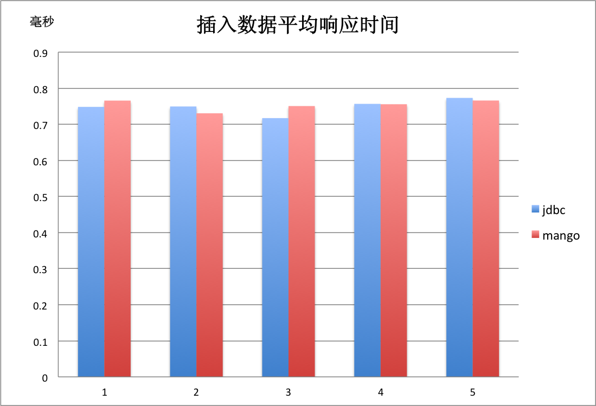

性能测试
========

测试服务器配置:

* **8核CPU（2194MHZ）**
* **64G内存**
* **db服务器为MySQL**

您可以在 `mango-benchmark <http://github.com/javacc/mango-benchmark>`_ 查看性能测试的源码。

插入测试
________

上图对比测试了5轮直接使用jdbc与使用mango插入数据的平均时间，每轮并发使用8个线程，每个线程插入10000条数据，平均每秒插入1万条左右数据。

查询测试
________

.. image:: _static/select.png
    :width: 600px

上图对比测试了5轮直接使用jdbc与使用mango查询数据的平均时间，每轮并发使用8个线程，每个线程随机查询10000条数据，平均每秒查询1.6万条左右数据。
