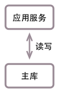
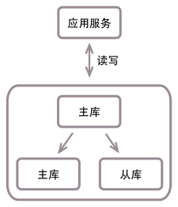

数据源工厂
==========

一般情况下，应用服务（或WEB服务）连数据库有3种大的方式：

1. 应用服务连单一数据库，所有的数据库读写请求都使用该数据库库，适用于小规模系统
2. 应用服务连主从数据库，数据库写请求使用主库，数据库读请求使用从库，适用于中等规模系统
3. 应用服务连多个单一数据库，多个主从数据库组成的混合数据库集群，适用于大规模系统
   
芒果框架内置了3种数据源工厂，分别对应上面3种连接方式，下面将进行详细介绍。

**为了描述简单，本文的数据源使用了芒果框架中内置的数据源DriverManagerDataSource，DriverManagerDataSource只是一个用于测试的简单数据源，线上环境请使用第三方数据源** 。

单一数据库
__________

SimpleDataSourceFactory即简单数据源工厂。应用服务所有的数据库读写请求使用单一数据库时，使用此数据源工厂。

下面是使用SimpleDataSourceFactory连单一数据库的结构图：

使用简单数据源工厂初始化mango对象的代码如下：

.. code-block:: java

    public static void main(String[] args) {
        String driverClassName = "com.mysql.jdbc.Driver";
        String url = "jdbc:mysql://localhost:3306/mango_example";
        String username = "root"; // 这里请使用您自己的用户名
        String password = "root"; // 这里请使用您自己的密码

        DataSource ds = new DriverManagerDataSource(driverClassName, url, username, password);
        DataSourceFactory dsf = new SimpleDataSourceFactory(ds);
        Mango mango = Mango.newInstance(dsf);
    }

由于简单数据源工厂只使用单一数据源，也可以将代码简写为：

.. code-block:: java

    public static void main(String[] args) {
        String driverClassName = "com.mysql.jdbc.Driver";
        String url = "jdbc:mysql://localhost:3306/mango_example";
        String username = "root"; // 这里请使用您自己的用户名
        String password = "root"; // 这里请使用您自己的密码

        DataSource ds = new DriverManagerDataSource(driverClassName, url, username, password);
        Mango mango = Mango.newInstance(ds);
    }

假设我们使用ArticleDao访问数据库中的article表：

.. code-block:: java

    @DB
    public interface ArticleDao {

        @ReturnGeneratedId
        @SQL("insert into article(uid, title, content) values(:uid, :title, :content)")
        int addArticle(Article article);

        @SQL("select id, uid, title, content from article where id = :1")
        Article getArticle(int id);

    }

使用简单数据源工厂SimpleDataSourceFactory时，写数据库请求ArticleDao.addArticle与读数据库请求ArticleDao.getArticle都会在单一数据库上执行。

主从数据库
__________

MasterSlaveDataSourceFactory即主从数据源工厂。应用服务的数据库写请求使用主库，数据库读请求使用从库时，使用此数据源工厂。

下面是使用MasterSlaveDataSourceFactory连主从数据库的结构图：

使用主从数据源工厂初始化mango对象的代码如下：

.. code-block:: java

    public static void main(String[] args) {
        String driverClassName = "com.mysql.jdbc.Driver";
        String url = "jdbc:mysql://localhost:3306/mango_example";
        String username = "root"; // 这里请使用您自己的用户名
        String password = "root"; // 这里请使用您自己的密码

        DataSource master = new DriverManagerDataSource(driverClassName, url, username, password);
        int slaveNum = 2;
        List<DataSource> slaves = new ArrayList<DataSource>();
        for (int i = 0; i < slaveNum; i++) {
            // 为了简单，参数与主库一致，实际情况下从库有不同的url，username，password
            slaves.add(new DriverManagerDataSource(driverClassName, url, username, password));
        }
        DataSourceFactory dsf = new MasterSlaveDataSourceFactory(master, slaves);
        Mango mango = Mango.newInstance(dsf);
    }

假设我们还是使用ArticleDao访问数据库中的article表：

.. code-block:: java

    @DB
    public interface ArticleDao {

        @ReturnGeneratedId
        @SQL("insert into article(uid, title, content) values(:uid, :title, :content)")
        int addArticle(Article article);

        @SQL("select id, uid, title, content from article where id = :1")
        Article getArticle(int id);

    }

使用主从数据源工厂MasterSlaveDataSourceFactory时，写数据库请求ArticleDao.addArticle都在主库执行，读数据库请求ArticleDao.getArticle会从从库列表中随机选择从库并执行。

混合数据库集群
______________

MultipleDatabaseDataSourceFactory即多数据库数据源工厂。应用服务连多个单一数据库或多个主从数据库组成的混合数据库集群时，使用此数据源工厂。

下面是使用MultipleDatabaseDataSourceFactory连混合数据库集群的结构图：

.. image:: _static/MultipleDatabaseDataSourceFactory.png

上图中，应用服务器既连接了单一数据库也连接了主从数据库，我们可以把MultipleDatabaseDataSourceFactory看成是一个大的容器，里面包含了一个或多个DataSourceFactory。以上图为例，MultipleDatabaseDataSourceFactory包含了1个SimpleDataSourceFactory用以连接单一数据库与1个MasterSlaveDataSourceFactory用以连接主从数据库。

当MultipleDatabaseDataSourceFactory中包含多个DataSourceFactory时，我们需要对每个DataSourceFactory进行命名从而加以区分，上图中，连接主从数据库的MasterSlaveDataSourceFactory被命名为db1，连接单一数据库的SimpleDataSourceFactory被命名为db2。

使用多数据库数据源工厂初始化mango对象的代码如下：

.. code-block:: java

    public static void main(String[] args) {
        String driverClassName = "com.mysql.jdbc.Driver";
        String username = "root"; // 这里请使用您自己的用户名
        String password = "root"; // 这里请使用您自己的密码

        // 主从数据库数据源工厂
        String url1 = "jdbc:mysql://localhost:3306/mango_example_db1";
        DataSource master = new DriverManagerDataSource(driverClassName, url1, username, password);
        int slaveNum = 2;
        List<DataSource> slaves = new ArrayList<DataSource>();
        for (int i = 0; i < slaveNum; i++) {
            // 为了简单，参数与主库一致，实际情况下从库有不同的url，username，password
            slaves.add(new DriverManagerDataSource(driverClassName, url1, username, password));
        }
        DataSourceFactory db1DataSourceFactory = new MasterSlaveDataSourceFactory(master, slaves);

        // 单一数据库数据源工厂
        String url2 = "jdbc:mysql://localhost:3306/mango_example_db2";
        DataSource ds = new DriverManagerDataSource(driverClassName, url2, username, password);
        DataSourceFactory db2DataSourceFactory = new SimpleDataSourceFactory(ds);

        Map<String, DataSourceFactory> factories = new HashMap<String, DataSourceFactory>();
        factories.put("db1", db1DataSourceFactory); // 将连接主从数据库的MasterSlaveDataSourceFactory命名为db1
        factories.put("db2", db2DataSourceFactory); // 将连接单一数据库的SimpleDataSourceFactory命名为db2
        DataSourceFactory dsf = new MultipleDatabaseDataSourceFactory(factories);
        Mango mango = Mango.newInstance(dsf);
    }

假设我们使用BlogDao访问主从数据库db1中的blog表，使用CommentDao访问单一数据库db2中的comment表：

.. code-block:: java

    @DB(database = "db1")
    public interface BlogDao {

        @ReturnGeneratedId
        @SQL("insert into blog(uid, title, content) values(:uid, :title, :content)")
        int addBlog(Blog blog);

        @SQL("select id, uid, title, content from blog where id = :1")
        Blog getBlog(int id);

    }

.. code-block:: java

    @DB(database = "db2")
    public interface CommentDao {

        @ReturnGeneratedId
        @SQL("insert into comment(uid, title, content) values(:uid, :title, :content)")
        int addComment(Comment comment);

        @SQL("select id, uid, title, content from comment where id = :1")
        Comment getComment(int id);

    }

请注意上面两段代码中@DB注解中database参数的取值，这里的database并不是MySQL中的database，而是指使用MultipleDatabaseDataSourceFactory中的哪个DataSourceFactory。在BlogDao中database="db1"，表示将使用MasterSlaveDataSourceFactory连接主从数据库；而在CommentDao中database="db2"，表示将使用SimpleDataSourceFactory连接单一数据库。

这样我们就是实现了BlogDao操作主从数据库中的blog表，而CommentDao则操作单一数据库中的comment表

查看完整示例代码和表结构
________________________

**数据源工厂** 的所有代码和表结构均可以在 `mango-example <https://github.com/jfaster/mango-example/tree/master/src/main/java/org/jfaster/mango/example/datasource>`_ 中找到。

