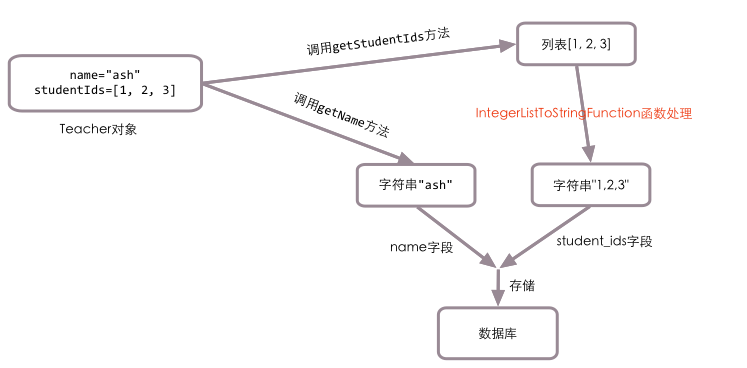
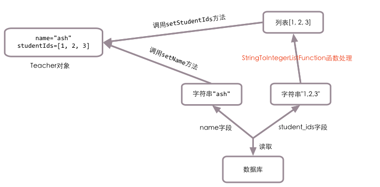
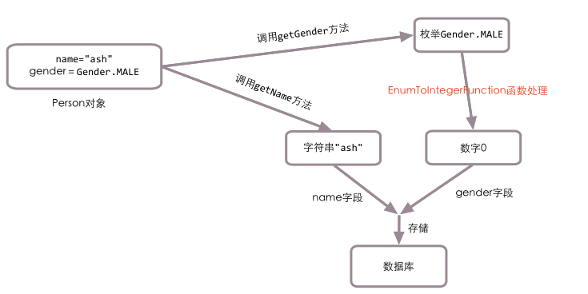
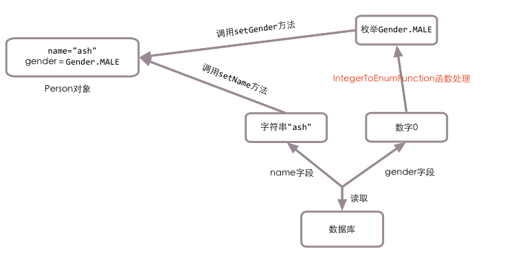
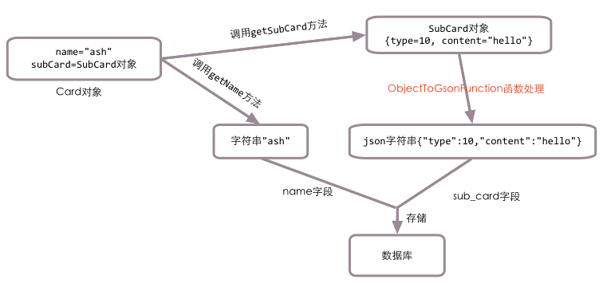
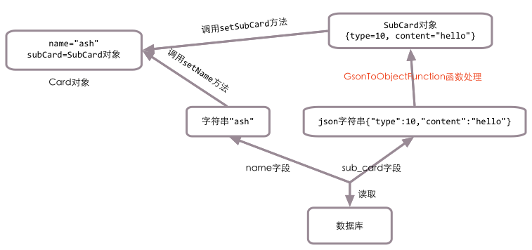

函数式调用
==========

很多时候我们需要将java中的列表，集合，自定义类映射到关系型数据库的某个字段中，直接插入取出显然是不行的，这时我们就需要使用函数式调用功能，将这些数据库不能识别的类型转化为数据库能够识别的类型插入，后续取出时再通过函数式调用转化为java中的复杂类型。

列表与字符串互转
________________

数据库中的teacher表如下(这里选择的是MySQL数据库):

.. code-block:: sql

    DROP TABLE IF EXISTS `teacher`;
    CREATE TABLE `teacher` (
      `id` int(11) NOT NULL AUTO_INCREMENT,
      `name` varchar(200) NOT NULL,
      `student_ids` varchar(1000) NOT NULL,
      PRIMARY KEY (`id`)
    ) ENGINE=InnoDB DEFAULT CHARSET=utf8;

与teacher表对应的java类:

.. code-block:: java

	public class Teacher {

	    private int id;

	    private String name;

	    private List<Integer> studentIds;

	    // id与name属性对应的get与set方法必须加上，这里省略掉了

	    @Getter(IntegerListToStringFunction.class)
	    public List<Integer> getStudentIds() {
	        return studentIds;
	    }

	    @Setter(StringToIntegerListFunction.class)
	    public void setStudentIds(List<Integer> studentIds) {
	        this.studentIds = studentIds;
	    }

	}

请注意studentIds属性的get与set方法，我们引入了4个新的类：

1. @Getter注解的全名为@org.jfaster.mango.annotation.Getter，它使用在get方法上。
2. IntegerListToStringFunction类的全名为org.jfaster.mango.invoker.function.IntegerListToStringFunction，它用于将整型列表转化为字符串。
3. @Setter注解的全名为@org.jfaster.mango.annotation.Setter，它使用在set方法上。
4. StringToIntegerListFunction类的全名为org.jfaster.mango.invoker.function.StringToIntegerListFunction，它用于将字符串转化为整型列表。

TeacherDao类:

.. code-block:: java

	@DB
	public interface TeacherDao {

	    @ReturnGeneratedId
	    @SQL("insert into teacher(name, student_ids) values(:name, :studentIds)")
	    public int addTeacher(Teacher t);

	    @SQL("select id, name, student_ids from teacher where id = :1")
	    public Teacher getTeacherById(int id);

	}

执行 **addTeacher** 方法的流程图如下图所示：

执行 **getTeacherById** 方法的流程图如下图所示：

枚举与数字互转
________________

数据库中的person表如下(这里选择的是MySQL数据库):

.. code-block:: sql

    DROP TABLE IF EXISTS `person`;
    CREATE TABLE `person` (
      `id` int(11) NOT NULL AUTO_INCREMENT,
      `name` varchar(200) NOT NULL,
      `gender` int(11) NOT NULL,
      PRIMARY KEY (`id`)
    ) ENGINE=InnoDB DEFAULT CHARSET=utf8;

与person表对应的java类:

.. code-block:: java

	public enum Gender {

	    MALE, FEMALE

	}

	public class Person {

	    private int id;

	    private String name;

	    private Gender gender;

	    public int getId() {
	        return id;
	    }
	    
	    // id与name属性对应的get与set方法必须加上，这里省略掉了

	    @Getter(EnumToIntegerFunction.class)
	    public Gender getGender() {
	        return gender;
	    }

	    @Setter(IntegerToEnumFunction.class)
	    public void setGender(Gender gender) {
	        this.gender = gender;
	    }

	}	

请注意gender属性的get与set方法:

1. EnumToIntegerFunction类的全名为org.jfaster.mango.invoker.function.enums.EnumToIntegerFunction，它会调用枚举对象的ordinal方法，将枚举对象转化为数字。
2. IntegerToEnumFunction类的全名为org.jfaster.mango.invoker.function.enums.IntegerToEnumFunction，它用于将数字转化为枚举对象。
   
PersonDao类:

.. code-block:: java

	@DB
	public interface PersonDao {

	    @ReturnGeneratedId
	    @SQL("insert into person(name, gender) values(:name, :gender)")
	    public int addPerson(Person p);

	    @SQL("select name, gender from person where id = :1")
	    public Person getPersonById(int id);

	}

执行 **addPerson** 方法的流程图如下图所示：

执行 **getPersonById** 方法的流程图如下图所示：

复杂类与字符串互转
__________________

数据库中的card表如下(这里选择的是MySQL数据库):

.. code-block:: sql

    DROP TABLE IF EXISTS `card`;
    CREATE TABLE `card` (
      `id` int(11) NOT NULL AUTO_INCREMENT,
      `name` varchar(200) NOT NULL,
      `sub_card` varchar(1000) NOT NULL,
      PRIMARY KEY (`id`)
    ) ENGINE=InnoDB DEFAULT CHARSET=utf8;

与card表对应的java类:

.. code-block:: java

	public class SubCard {

	    private int type;

	    private String content;

	    // type与content属性对应的get与set方法必须加上，这里省略掉了
	    
	}

	public class Card {

	    private int id;

	    private String name;

	    private SubCard subCard;

	    // id与name属性对应的get与set方法必须加上，这里省略掉了

	    @Getter(ObjectToGsonFunction.class)
	    public SubCard getSubCard() {
	        return subCard;
	    }

	    @Setter(GsonToObjectFunction.class)
	    public void setSubCard(SubCard subCard) {
	        this.subCard = subCard;
	    }

	}

请注意subCard属性的get与set方法:

1. ObjectToGsonFunction类的全名为org.jfaster.mango.invoker.function.json.ObjectToGsonFunction，它使用gson包，能将任意对象转化为json字符串。
2. GsonToObjectFunction类的全名为org.jfaster.mango.invoker.function.json.GsonToObjectFunction，它使用gson包，能将json字符串转化为任意对象。
   
CardDao类:

.. code-block:: java

	@DB
	public interface CardDao {

	    @ReturnGeneratedId
	    @SQL("insert into card(name, sub_card) values(:name, :subCard)")
	    public int addCard(Card c);

	    @SQL("select name, sub_card from card where id = :1")
	    public Card getCardById(int id);

	}

执行 **addCard** 方法的流程图如下图所示：

执行 **getCardById** 方法的流程图如下图所示：

查看完整示例代码和表结构
________________________

**函数式调用** 的所有代码和表结构均可以在 `mango-example <https://github.com/jfaster/mango-example/tree/master/src/main/java/org/jfaster/mango/example/functional>`_ 中找到。
