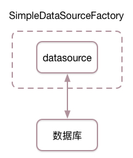
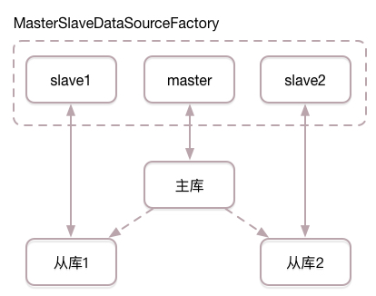
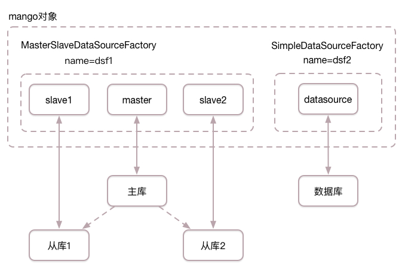

数据源工厂
==========

一般情况下，应用服务（或WEB服务）连数据库有3种大的方式：

1. 应用服务连单一数据库，所有的数据库读写请求都使用该数据库库，适用于小规模系统
2. 应用服务连主从数据库，数据库写请求使用主库，数据库读请求使用从库，适用于中等规模系统
3. 应用服务连多个单一数据库，多个主从数据库组成的混合数据库集群，适用于大规模系统
   
芒果框架能完美支持上面3种连接方式，下面将进行详细介绍。

为了描述简单，本文的数据源使用了芒果框架中内置的数据源DriverManagerDataSource，DriverManagerDataSource只是一个用于测试的简单数据源，线上环境请使用 `HikariCP <https://github.com/brettwooldridge/HikariCP>`_ 等第三方高性能数据源。

单一数据库
__________

应用服务所有的数据库读写请求使用单一数据库时，我们使用简单数据源工厂SimpleDataSourceFactory管理数据源，示例代码如下：

.. code-block:: java

    public static void main(String[] args) {
        String driverClassName = "com.mysql.jdbc.Driver";
        String url = "jdbc:mysql://localhost:3306/mango_example";
        String username = "root"; // 这里请使用您自己的用户名
        String password = "root"; // 这里请使用您自己的密码

        DataSource datasource = new DriverManagerDataSource(driverClassName, url, username, password);
        DataSourceFactory dsf = new SimpleDataSourceFactory(datasource);
        Mango mango = Mango.newInstance(dsf);
    }

上面的代码中：我们首先初始化了数据源datasource，数据库的读写请求都是用此数据源；然后我们用此数据源初始化简单数据源工厂SimpleDataSourceFactory；最后使用此数据源工厂初始化mango对象。

代码对应的结构图如下所示：

由于简单数据源工厂只使用单一数据源，也可以将代码简写为：

.. code-block:: java

    public static void main(String[] args) {
        String driverClassName = "com.mysql.jdbc.Driver";
        String url = "jdbc:mysql://localhost:3306/mango_example";
        String username = "root"; // 这里请使用您自己的用户名
        String password = "root"; // 这里请使用您自己的密码

        DataSource datasource = new DriverManagerDataSource(driverClassName, url, username, password);
        Mango mango = Mango.newInstance(datasource);
    }

假设我们使用ArticleDao访问数据库中的article表：

.. code-block:: java

    @DB
    public interface ArticleDao {

        @ReturnGeneratedId
        @SQL("insert into article(uid, title, content) values(:uid, :title, :content)")
        public int addArticle(Article article);

        @SQL("select id, uid, title, content from article where id = :1")
        public Article getArticle(int id);

    }

使用简单数据源工厂SimpleDataSourceFactory时，写数据库请求ArticleDao.addArticle与读数据库请求ArticleDao.getArticle都会在单一数据库上执行。

主从数据库
__________

应用服务的数据库写请求使用主库，数据库读请求使用从库时，我们使用主从数据源工厂MasterSlaveDataSourceFactory管理数据源，示例代码如下：

.. code-block:: java

    public static void main(String[] args) {
        String driverClassName = "com.mysql.jdbc.Driver";
        String url = "jdbc:mysql://localhost:3306/mango_example";
        String username = "root"; // 这里请使用您自己的用户名
        String password = "root"; // 这里请使用您自己的密码

        // 连主库的数据源
        DataSource master = new DriverManagerDataSource(driverClassName, url, username, password);

        // 连从库的数据库，为了简单，参数与主库一致，实际情况下从库有不同的url，username，password
        DataSource slave1 = new DriverManagerDataSource(driverClassName, url, username, password);
        DataSource slave2 = new DriverManagerDataSource(driverClassName, url, username, password);

        DataSourceFactory dsf = new MasterSlaveDataSourceFactory(master, Arrays.asList(slave1, slave2));
        Mango mango = Mango.newInstance(dsf);
    }

上面的代码中：我们首先初始化数据源master用于连接主库，初始化数据源slave1与slave2用于连接两个不同的从库；然后我们用数据源master，slave1，slave2初始化主从数据源工厂MasterSlaveDataSourceFactory；最后使用此数据源工厂初始化mango对象。

代码对应的结构图如下所示：

假设我们还是使用ArticleDao访问数据库中的article表：

.. code-block:: java

    @DB
    public interface ArticleDao {

        @ReturnGeneratedId
        @SQL("insert into article(uid, title, content) values(:uid, :title, :content)")
        public int addArticle(Article article);

        @SQL("select id, uid, title, content from article where id = :1")
        public Article getArticle(int id);

    }

使用主从数据源工厂MasterSlaveDataSourceFactory时，写数据库请求ArticleDao.addArticle都在主库执行，读数据库请求ArticleDao.getArticle会从从库列表中随机选择从库并执行。

.. _混合数据库集群:

混合数据库集群
______________

上面无论是连单一数据库还是主从数据库，我们都是使用单个数据源工厂来初始化mango对象。当应用服务需要连多个单一数据库或多个主从数据库组成的混合数据库集群时，我们可以使用多个数据源工厂管理数据源，并使用多个数据源工厂来初始化mango对象，示例代码如下：

.. code-block:: java

    public static void main(String[] args) {
        String driverClassName = "com.mysql.jdbc.Driver";
        String username = "root"; // 这里请使用您自己的用户名
        String password = "root"; // 这里请使用您自己的密码

        // 主从数据源工厂，为了简单，从库参数与主库一致
        String url1 = "jdbc:mysql://localhost:3306/mango_example_db1";
        String name1 = "dsf1";
        DataSource master = new DriverManagerDataSource(driverClassName, url1, username, password);
        DataSource slave1 = new DriverManagerDataSource(driverClassName, url1, username, password);
        DataSource slave2 = new DriverManagerDataSource(driverClassName, url1, username, password);
        List<DataSource> slaves = Arrays.asList(slave1, slave2);
        DataSourceFactory dsf1 = new MasterSlaveDataSourceFactory(name1, master, slaves);

        // 简单数据源工厂
        String name2 = "dsf2";
        String url2 = "jdbc:mysql://localhost:3306/mango_example_db2";
        DataSource datasource = new DriverManagerDataSource(driverClassName, url2, username, password);
        DataSourceFactory dsf2 = new SimpleDataSourceFactory(name2, datasource);

        Mango mango = Mango.newInstance(Arrays.asList(dsf1, dsf2));
    }

上面的代码中：我们按照之前的代码，初始化了一个主从数据源工厂与一个简单数据源工厂，并用这两个数据源工厂初始化mango对象。这里需要特别注意的是：由于我们使用了多个数据源工厂初始化mango对象，我们分别对这两个数据源工厂进行了命名，以便于在下面的DAO调用中选择数据源工厂，这里主从数据源工厂名字叫做dsf1，简单数据源工厂名字叫做dsf2。

代码对应的结构图如下所示：

假设我们使用BlogDao访问主从数据库中的blog表，使用CommentDao访问单一数据库中的comment表：

.. code-block:: java

    @DB(name = "dsf1")
    public interface BlogDao {

        @ReturnGeneratedId
        @SQL("insert into blog(uid, title, content) values(:uid, :title, :content)")
        public int addBlog(Blog blog);

        @SQL("select id, uid, title, content from blog where id = :1")
        public Blog getBlog(int id);

    }

.. code-block:: java

    @DB(name = "dsf2")
    public interface CommentDao {

        @ReturnGeneratedId
        @SQL("insert into comment(uid, title, content) values(:uid, :title, :content)")
        public int addComment(Comment comment);

        @SQL("select id, uid, title, content from comment where id = :1")
        public Comment getComment(int id);

    }

**请注意上面两段代码中@DB注解中name参数的取值，这里的name用于指定所使用数据源工厂的名字**。

在BlogDao中，name=dsf1，表明使用名字为dsf1的数据源工厂，也即上面的主从数据源工厂，对应主从数据库。

在CommentDao中，name=dsf2，表明使用名字为dsf2的数据源工厂，也即上面的简单数据源工厂，对应单一数据库。

查看完整示例代码和表结构
________________________

**数据源工厂** 的所有代码和表结构均可以在 `mango-example <https://github.com/jfaster/mango-example/tree/master/src/main/java/org/jfaster/mango/example/datasource>`_ 中找到。

