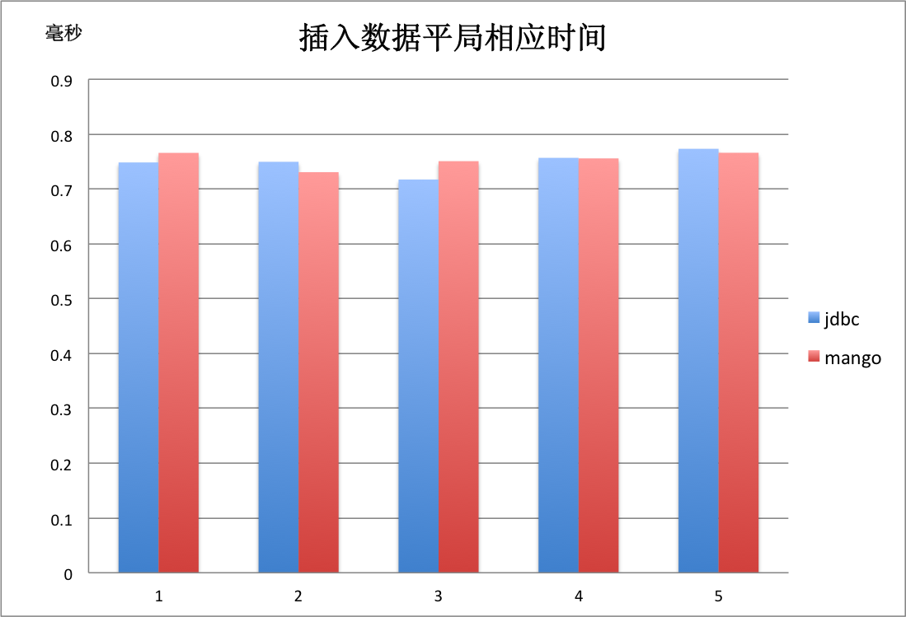

欢迎使用mango
=============

**mango的中文名是“芒果”，它是一个极速分布式ORM框架。目前已有十多个大型线上项目在使用mango，在某一支付系统中，更是利用mango，承载了每秒12万的支付下单请求。**

下面是mango的一些特性:

* 超高性能，响应速度接近直接使用JDBC
* 采用接口与注解的形式定义DAO，完美结合db与cache操作
* 支持动态sql，可以构造任意复杂的sql语句
* 支持多数据源，分表，分库，事务
* 提供拦截器功能，利用拦截器可为mango框架扩展各种自定义插件
* 独创“函数式调用”功能，能将任意复杂的对象，映射到数据库的表中
* 高效详细的实时统计系统，方便开发者随时了解自己的系统
* 独立jar包，不依赖其它jar包
* 提供便捷的spring插件，与spring无缝集成

性能测试
________

我们使用由甲骨文JVM性能团队提供的工具 `JMH <http://openjdk.java.net/projects/code-tools/jmh>`_ 对mybatis，spring-jdbc，mango和直接使用jdbc进行了性能测试。您可以checkout性能测试源码 `mango-benchmark <https://github.com/jfaster/mango-benchmark>`_ 查看测试细节并自行运行获得测试结果。

* 1次 **Query Cycle** 被定义为简单执行1次查询：``select id, name, age from user where id = ?``
* 1次 **Update Cycle** 被定义为简单执行1次更新：``update user set age = ? where id = ?``

获得mango
_________

由于mango不依赖其它jar包，所以可以直接 `下载mango-2.0.1.jar <http://search.maven.org/remotecontent?filepath=org/jfaster/mango/2.0.1/mango-2.0.1.jar>`_ ，并将它放在工程的classpath下。

当然mango也已经上传到 `maven中心库 <http://search.maven.org/#search%7Cgav%7C1%7Cg%3A%22org.jfaster%22%20AND%20a%3A%22mango%22>`_ 中，如果您的工程在使用maven，那么只需要在pom.xml文件中添加下面的依赖就能使用mango的功能。

.. code-block:: xml

    <dependency>
        <groupId>org.jfaster</groupId>
        <artifactId>mango</artifactId>
        <version>2.0.1</version>
    </dependency>

需要注意的是，只使用mango是无法连接数据库成功的，对于连接不同的数据库，您还需要添加相应的JDBC驱动，以连接MySQL数据库为例，您还需要用到 `mysql-connector-java <http://search.maven.org/#search%7Cgav%7C1%7Cg%3A%22mysql%22%20AND%20a%3A%22mysql-connector-java%22>`_ 。

.. code-block:: xml

    <dependency>
        <groupId>mysql</groupId>
        <artifactId>mysql-connector-java</artifactId>
        <version>5.1.29</version>
    </dependency>

如何使用mango
_____________

您可以去 :ref:`快速开始` 实现并运行第一个mango程序

您也可以去 :ref:`文档目录` 查看所有的文档
