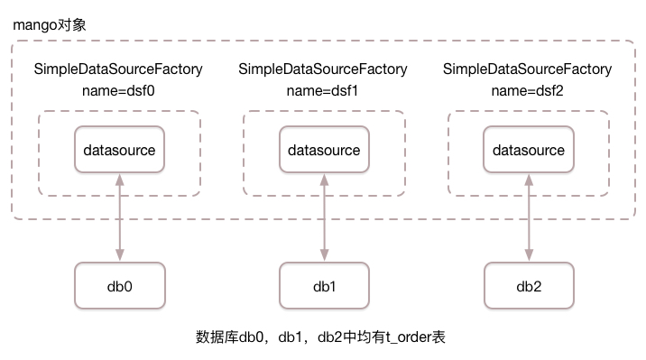

表分片与数据库分片(分表与分库)
==============================

表分片
______

表分片通常也被称为分表，散表。
当某张表的数据量很大时，sql执行效率都会变低，这时通常会把大表拆分成多个小表，以提高sql执行效率。
我们将这种大表拆分成多个小表的策略称之为表分片。

下面我们通过一实际例子，展示如何使用mango框架完成表分片（分表）。

需求描述
^^^^^^^^

数据库中有t_order_0与t_order_1共2张表，我们按照用户ID（后续简称uid）纬度进行表分片：

* uid小于等于1000时，使用t_order_0表
* uid大于1000时，时使用t_order_1表

书写DAO接口
^^^^^^^^^^^

.. code-block:: java

    public class TableShardingOrderDaoMain {

        public static void main(String[] args) {
            String driverClassName = "com.mysql.jdbc.Driver";
            String url = "jdbc:mysql://localhost:3306/mango_example";
            String username = "root"; // 这里请使用您自己的用户名
            String password = "root"; // 这里请使用您自己的密码
            DataSource ds = new DriverManagerDataSource(driverClassName, url, username, password);
            Mango mango = Mango.newInstance(ds);
        }

        @DB(table = "t_order")
        public interface TableShardingOrderDao {

            @SQL("insert into #table(id, uid, price, status) values(:id, :uid, :price, :status)")
            public void addOrder(Order order);

            @SQL("select id, uid, price, status from #table where uid = :1")
            public List<Order> getOrdersByUid(int uid);

        }

    }

上面的代码中，我们新添加了TableShardingOrderDao接口，其中addOrder方法用于向t_order表插入订单，getOrdersByUid方法用于根据uid从t_order表读取订单列表。
为了后续实现表分片，这里我们使用了 :ref:`全局表名`。

定义表分片策略
^^^^^^^^^^^^^^

.. code-block:: java
    :emphasize-lines: 23,24

    public class TableShardingOrderDaoMain {

        public static void main(String[] args) {
            // DataSource ds = ...
            Mango mango = Mango.newInstance(ds);
        }

        @DB(table = "t_order")
        public interface TableShardingOrderDao {

            @SQL("insert into #table(id, uid, price, status) values(:id, :uid, :price, :status)")
            public void addOrder(Order order);

            @SQL("select id, uid, price, status from #table where uid = :1")
            public List<Order> getOrdersByUid(int uid);

        }

        static class OrderTableShardingStrategy implements TableShardingStrategy<Integer> {

            @Override
            public String getTargetTable(String table, Integer uid) {
                int num = uid <= 1000 ? 0 : 1;
                return table + "_" + num;
            }

        }

    }

上面的代码中，我们新添加了OrderTableShardingStrategy类，OrderTableShardingStrategy类实现了 `TableShardingStrategy <https://github.com/jfaster/mango/blob/master/src/main/java/org/jfaster/mango/sharding/TableShardingStrategy.java>`_ 接口中的 ``getTargetTable`` 方法。

getTargetTable方法是表分片策略的核心，共两个输入参数，输出则为最终需要访问的表名字，所以我们通过实现getTargetTable方法计算最终需要访问的表名字。

第1个参数table为@DB注解中table参数所定义的全局表名，这里是t_order。

第2个参数是自定义传入的参数，这里由于我们要使用uid计算如何分表，所以第2个参数是uid，有关uid如何传入会在下文中进行讲解。需要注意的是，第2个参数是一个泛型参数，这里由于uid是整形数字，所以类型定义为Integer。

表分片策略与DAO接口绑定
^^^^^^^^^^^^^^^^^^^^^^^

有了DAO接口与表分片策略，下面我们使用 `@Sharding <https://github.com/jfaster/mango/blob/master/src/main/java/org/jfaster/mango/annotation/Sharding.java>`_ 注解中的tableShardingStrategy参数，将表分片策略与DAO接口进行绑定，具体代码如下：

.. code-block:: java
    :emphasize-lines: 9

    public class TableShardingOrderDaoMain {

        public static void main(String[] args) {
            // DataSource ds = ...
            Mango mango = Mango.newInstance(ds);
        }

        @DB(table = "t_order")
        @Sharding(tableShardingStrategy = OrderTableShardingStrategy.class)
        public interface TableShardingOrderDao {

            @SQL("insert into #table(id, uid, price, status) values(:id, :uid, :price, :status)")
            public void addOrder(Order order);

            @SQL("select id, uid, price, status from #table where uid = :1")
            public List<Order> getOrdersByUid(int uid);

        }

        static class OrderTableShardingStrategy implements TableShardingStrategy<Integer> {

            @Override
            public String getTargetTable(String table, Integer uid) {
                int num = uid <= 1000 ? 0 : 1;
                return table + "_" + num;
            }

        }

    }

表分片策略参数传入
^^^^^^^^^^^^^^^^^^

最后我们还需将参数uid传入到表分片策略中，所以mango框架引入了 `@TableShardingBy <https://github.com/jfaster/mango/blob/master/src/main/java/org/jfaster/mango/annotation/TableShardingBy.java>`_ 注解用于指定给表分片策略传入的参数，具体代码如下：

.. code-block:: java
    :emphasize-lines: 13,16

    public class TableShardingOrderDaoMain {

        public static void main(String[] args) {
            // DataSource ds = ...
            Mango mango = Mango.newInstance(ds);
        }

        @DB(table = "t_order")
        @Sharding(tableShardingStrategy = OrderTableShardingStrategy.class)
        public interface TableShardingOrderDao {

            @SQL("insert into #table(id, uid, price, status) values(:id, :uid, :price, :status)")
            public void addOrder(@TableShardingBy("uid") Order order);

            @SQL("select id, uid, price, status from #table where uid = :1")
            public List<Order> getOrdersByUid(@TableShardingBy int uid);

        }

        static class OrderTableShardingStrategy implements TableShardingStrategy<Integer> {

            @Override
            public String getTargetTable(String table, Integer uid) {
                int num = uid <= 1000 ? 0 : 1;
                return table + "_" + num;
            }

        }

    }

上面的代码中，调用 ``addOrder(@TableShardingBy("uid") Order order)`` 方法时，会使用order对象中的uid属性作为参数传递给表分片策略，而调用 ``getOrdersByUid(@TableShardingBy int uid)`` 方法时，会使用uid作为参数传递给表分片策略。

数据库分片
__________

数据库分片通常也被称为分库，散库等。
当我们在某个库中，把某张大表拆分成多个小表后还不能满足性能要求，这时我们需要把一部分拆分的表挪到另外一个库中，以提高sql执行效率。

下面我们通过一实际例子，展示如何使用mango框架完成数据库分片（分库）。

需求描述
^^^^^^^^

3个独立数据库db0，db1，db2中，各有1张t_order表，在读写t_order表时，我们按照用户ID（后续简称uid）纬度进行数据库分片：

* uid模3为0的请求落在数据库db0
* uid模3为1的请求落在数据库db1
* uid模3为2的请求落在数据库db2

.. _初始化数据库源工厂:

初始化数据库源工厂
^^^^^^^^^^^^^^^^^^

.. code-block:: java

    public class DatabaseShardingOrderDaoMain {

        public static void main(String[] args) {
            String driverClassName = "com.mysql.jdbc.Driver";
            String username = "root"; // 这里请使用您自己的用户名
            String password = "root"; // 这里请使用您自己的密码

            int dbNum = 3;
            List<DataSourceFactory> dsfs = new ArrayList<DataSourceFactory>();
            for (int i = 0; i < dbNum; i++) {
                String name = "dsf" + i;
                String url = "jdbc:mysql://localhost:3306/db" + i;
                DataSource ds = new DriverManagerDataSource(driverClassName, url, username, password);
                DataSourceFactory dsf = new SimpleDataSourceFactory(name, ds);
                dsfs.add(dsf);
            }
            Mango mango = Mango.newInstance(dsfs);
        }
    }

上面的代码中，我们初始化了3个简单数据源工厂：

* 名字为dsf0的数据源工厂连接数据库db0
* 名字为dsf1的数据源工厂连接数据库db1
* 名字为dsf2的数据源工厂连接数据库db2

代码对应的结构图如下所示：

书写DAO接口
^^^^^^^^^^^

.. code-block:: java

    public class DatabaseShardingOrderDaoMain {

        public static void main(String[] args) {
            // List<DataSourceFactory> dsfs = ...
            Mango mango = Mango.newInstance(dsfs);
        }

        @DB()
        public interface DatabaseShardingOrderDao {

            @SQL("insert into t_order(id, uid, price, status) values(:id, :uid, :price, :status)")
            public void addOrder(Order order);

            @SQL("select id, uid, price, status from t_order where uid = :1")
            public List<Order> getOrdersByUid(int uid);

        }

    }

上面的代码中，我们新添加了DatabaseShardingOrderDao接口，其中addOrder方法用于向t_order表插入订单，getOrdersByUid方法用于根据uid从t_order表读取订单列表。

定义数据库分片策略
^^^^^^^^^^^^^^^^^^

.. code-block:: java
    :emphasize-lines: 23

    public class DatabaseShardingOrderDaoMain {

        public static void main(String[] args) {
            // List<DataSourceFactory> dsfs = ...
            Mango mango = Mango.newInstance(dsfs);
        }

        @DB()
        public interface DatabaseShardingOrderDao {

            @SQL("insert into t_order(id, uid, price, status) values(:id, :uid, :price, :status)")
            public void addOrder(Order order);

            @SQL("select id, uid, price, status from t_order where uid = :1")
            public List<Order> getOrdersByUid(int uid);

        }

        static class OrderDatabaseShardingStrategy implements DatabaseShardingStrategy<Integer> {

            @Override
            public String getDataSourceFactoryName(Integer uid) {
                return "dsf" + uid % 3;
            }

        }

    }

上面的代码中，我们新添加了OrderDatabaseShardingStrategy类，OrderDatabaseShardingStrategy类实现了 `DatabaseShardingStrategy <https://github.com/jfaster/mango/blob/master/src/main/java/org/jfaster/mango/sharding/DatabaseShardingStrategy.java>`_ 接口中的 ``getDataSourceFactoryName`` 方法。

getDataSourceFactoryName方法是数据库分片策略的核心，返回最终请求的数据源工厂名称。而getDataSourceFactoryName方法的输入参数是一个自定义传入的参数，这里由于我们要使用uid计算如何分库，所以参数为uid，有关uid如何传入会在下文中进行讲解。需要注意的是，输入参数是一个泛型参数，这里由于uid是整形数字，所以类型定义为Integer。

在 :ref:`初始化数据库源工厂` 中我们定义了dsf0，dsf1，dsf2共3个数据源工厂，分别对应db0，db1，db2这3个数据库。所以当我们想访问db0中的t_order表时，我们只需要让getDataSourceFactoryName方法返回dsf0；当我们想访问db1中的t_order表时，我们只需要让getDataSourceFactoryName方法返回dsf1，并以此类推。

数据库分片策略与DAO接口绑定
^^^^^^^^^^^^^^^^^^^^^^^^^^^

有了DAO接口与数据库分片策略，下面我们使用 `@Sharding <https://github.com/jfaster/mango/blob/master/src/main/java/org/jfaster/mango/annotation/Sharding.java>`_ 注解中的databaseShardingStrategy参数，将数据库分片策略与DAO接口进行绑定，具体代码如下：

.. code-block:: java
    :emphasize-lines: 9

    public class DatabaseShardingOrderDaoMain {

        public static void main(String[] args) {
            // List<DataSourceFactory> dsfs = ...
            Mango mango = Mango.newInstance(dsfs);
        }

        @DB()
        @Sharding(databaseShardingStrategy = OrderDatabaseShardingStrategy.class)
        public interface DatabaseShardingOrderDao {

            @SQL("insert into t_order(id, uid, price, status) values(:id, :uid, :price, :status)")
            public void addOrder(Order order);

            @SQL("select id, uid, price, status from t_order where uid = :1")
            public List<Order> getOrdersByUid(int uid);

        }

        static class OrderDatabaseShardingStrategy implements DatabaseShardingStrategy<Integer> {

            @Override
            public String getDataSourceFactoryName(Integer uid) {
                return "dsf" + uid % 3;
            }

        }

    }

数据库分片策略参数传入
^^^^^^^^^^^^^^^^^^^^^^

最后我们还需将参数uid传入到数据库分片策略中，所以mango框架引入了 `@DatabaseShardingBy <https://github.com/jfaster/mango/blob/master/src/main/java/org/jfaster/mango/annotation/DatabaseShardingBy.java>`_ 注解用于指定给数据库分片策略传入的参数，具体代码如下：

.. code-block:: java
    :emphasize-lines: 13,16

    public class DatabaseShardingOrderDaoMain {

        public static void main(String[] args) {
            // List<DataSourceFactory> dsfs = ...
            Mango mango = Mango.newInstance(dsfs);
        }

        @DB()
        @Sharding(databaseShardingStrategy = OrderDatabaseShardingStrategy.class)
        public interface DatabaseShardingOrderDao {

            @SQL("insert into t_order(id, uid, price, status) values(:id, :uid, :price, :status)")
            public void addOrder(@DatabaseShardingBy("uid") Order order);

            @SQL("select id, uid, price, status from t_order where uid = :1")
            public List<Order> getOrdersByUid(@DatabaseShardingBy int uid);

        }

        static class OrderDatabaseShardingStrategy implements DatabaseShardingStrategy<Integer> {

            @Override
            public String getDataSourceFactoryName(Integer uid) {
                return "dsf" + uid % 3;
            }

        }

    }

上面的代码中，调用 ``addOrder(@DatabaseShardingBy("uid") Order order)`` 方法时，会使用order对象中的uid属性作为参数传递给数据库分片策略，而调用 ``getOrdersByUid(@DatabaseShardingBy int uid)`` 方法时，会使用uid作为参数传递给数据库分片策略。

同时使用数据库分片与表分片
__________________________

我们将上面的数据库分片策略与表分片策略一起使用，形成同时使用数据库分片与表分片的代码：

.. code-block:: java

    public class ShardingOrderDaoMain {

        public static void main(String[] args) {
            String driverClassName = "com.mysql.jdbc.Driver";
            String username = "root"; // 这里请使用您自己的用户名
            String password = "root"; // 这里请使用您自己的密码

            int dbNum = 3;
            List<DataSourceFactory> dsfs = new ArrayList<DataSourceFactory>();
            for (int i = 0; i < dbNum; i++) {
                String name = "dsf" + i;
                String url = "jdbc:mysql://localhost:3306/db" + i;
                DataSource ds = new DriverManagerDataSource(driverClassName, url, username, password);
                DataSourceFactory dsf = new SimpleDataSourceFactory(name, ds);
                dsfs.add(dsf);
            }
            Mango mango = Mango.newInstance(dsfs);
            ShardingOrderDao orderDao = mango.create(ShardingOrderDao.class);

            // 后续DAO操作
        }

        @DB(table = "t_order")
        @Sharding(
                databaseShardingStrategy = OrderDatabaseShardingStrategy.class,
                tableShardingStrategy = OrderTableShardingStrategy.class
        )
        public interface ShardingOrderDao {

            @SQL("insert into #table(id, uid, price, status) values(:id, :uid, :price, :status)")
            public void addOrder(@DatabaseShardingBy("uid") @TableShardingBy("uid") Order order);

            @SQL("select id, uid, price, status from #table where uid = :1")
            public List<Order> getOrdersByUid(@DatabaseShardingBy @TableShardingBy int uid);

        }

        static class OrderDatabaseShardingStrategy implements DatabaseShardingStrategy<Integer> {

            @Override
            public String getDataSourceFactoryName(Integer uid) {
                return "dsf" + uid % 3;
            }

        }

        static class OrderTableShardingStrategy implements TableShardingStrategy<Integer> {

            @Override
            public String getTargetTable(String table, Integer uid) {
                int num = uid <= 1000 ? 0 : 1;
                return table + "_" + num;
            }

        }

    }

数据库分片策略使用了OrderDatabaseShardingStrategy类：

* uid模3为0的请求落在数据库db0
* uid模3为1的请求落在数据库db1
* uid模3为2的请求落在数据库db2

表分片策略则使用了OrderTableShardingStrategy类：

* uid小于等于1000时，使用t_order_0表
* uid大于1000时，时使用t_order_1表

同时使用数据库分片策略与表分片策略得到如下规则：

* uid模3为0且小于等于1000时，使用db0中的t_order_0表
* uid模3为1且小于等于1000时，使用db1中的t_order_0表
* uid模3为2且小于等于1000时，使用db2中的t_order_0表
* uid模3为1且大于1000时，使用db0中的t_order_1表
* uid模3为1且大于1000时，使用db1中的t_order_1表
* uid模3为1且大于1000时，使用db2中的t_order_1表

精简分片代码
____________

下面的代码同样实现了同时使用数据库分片与表分片，不过更加简洁。

.. code-block:: java

    public class SmartShardingOrderDaoMain {

        public static void main(String[] args) {
            String driverClassName = "com.mysql.jdbc.Driver";
            String username = "root"; // 这里请使用您自己的用户名
            String password = "root"; // 这里请使用您自己的密码

            int dbNum = 3;
            List<DataSourceFactory> dsfs = new ArrayList<DataSourceFactory>();
            for (int i = 0; i < dbNum; i++) {
                String name = "dsf" + i;
                String url = "jdbc:mysql://localhost:3306/db" + i;
                DataSource ds = new DriverManagerDataSource(driverClassName, url, username, password);
                DataSourceFactory dsf = new SimpleDataSourceFactory(name, ds);
                dsfs.add(dsf);
            }
            Mango mango = Mango.newInstance(dsfs);
            SmartShardingOrderDao orderDao = mango.create(SmartShardingOrderDao.class);

            // 后续DAO操作
        }

        @DB(table = "t_order")
        @Sharding(shardingStrategy = OrderShardingStrategy.class)
        public interface SmartShardingOrderDao {

            @SQL("insert into #table(id, uid, price, status) values(:id, :uid, :price, :status)")
            public void addOrder(@ShardingBy("uid") Order order);

            @SQL("select id, uid, price, status from #table where uid = :1")
            public List<Order> getOrdersByUid(@ShardingBy int uid);

        }

        static class OrderShardingStrategy implements ShardingStrategy<Integer, Integer> {

            @Override
            public String getDataSourceFactoryName(Integer uid) {
                return "dsf" + uid % 3;
            }

            @Override
            public String getTargetTable(String table, Integer uid) {
                int num = uid <= 1000 ? 0 : 1;
                return table + "_" + num;
            }

        }

    }

上面的代码中：

- 引入了 `@ShardingBy <https://github.com/jfaster/mango/blob/master/src/main/java/org/jfaster/mango/annotation/ShardingBy.java>`_ 注解，使用@ShardingBy注解等于同时使用@DatabaseShardingBy注解与@TableShardingBy注解。

- 引入了 `@ShardingStrategy <https://github.com/jfaster/mango/blob/master/src/main/java/org/jfaster/mango/sharding/ShardingStrategy.java>`_ 接口，实现@ShardingStrategy接口等与同时实现@DatabaseShardingStrategy接口与@TableShardingStrategy接口。

多维度分片策略
______________

上面的所有的代码我们都使用uid作为分片策略的计算参数，我们称之为一维分片策略。

考虑下面一个问题，当我们把数据库分片信息与表分片信息保存到order表中id字段的头部时，我们不但能把uid作为分片策略的计算参数，也能把id作为分片策略的计算参数。但@Sharding注解放在类上时，我们只能要么选择uid作为分片策略的计算参数，要们选择id作为分片策略的计算参数。这时我们需要将@Sharding注解下移到方法上，不同的方法指定不同的分片策略，实现多维度分片策略。

请看下面的代码：

.. code-block:: java

    public class MultiDimenShardingOrderDaoMain {

        public static void main(String[] args) {
            String driverClassName = "com.mysql.jdbc.Driver";
            String username = "root"; // 这里请使用您自己的用户名
            String password = "root"; // 这里请使用您自己的密码

            int dbNum = 3;
            List<DataSourceFactory> dsfs = new ArrayList<DataSourceFactory>();
            for (int i = 0; i < dbNum; i++) {
                String name = "dsf" + i;
                String url = "jdbc:mysql://localhost:3306/db" + i;
                DataSource ds = new DriverManagerDataSource(driverClassName, url, username, password);
                DataSourceFactory dsf = new SimpleDataSourceFactory(name, ds);
                dsfs.add(dsf);
            }
            Mango mango = Mango.newInstance(dsfs);
            MultiDimenShardingOrderDao orderDao = mango.create(MultiDimenShardingOrderDao.class);

            // 后续DAO操作
        }

        @DB(table = "t_order")
        public interface MultiDimenShardingOrderDao {

            @SQL("insert into #table(id, uid, price, status) values(:id, :uid, :price, :status)")
            @Sharding(shardingStrategy = OrderUidShardingStrategy.class)
            public void addOrder(@ShardingBy("uid") Order order);

            @SQL("select id, uid, price, status from #table where uid = :1")
            @Sharding(shardingStrategy = OrderUidShardingStrategy.class)
            public List<Order> getOrdersByUid(@ShardingBy int uid);

            @SQL("select id, uid, price, status from #table where id = :1")
            @Sharding(shardingStrategy = OrderIdShardingStrategy.class)
            public Order getOrderById(@ShardingBy String id);

        }

        static class OrderUidShardingStrategy implements ShardingStrategy<Integer, Integer> {

            @Override
            public String getDataSourceFactoryName(Integer uid) {
                return "dsf" + uid % 3;
            }

            @Override
            public String getTargetTable(String table, Integer uid) {
                int num = uid <= 1000 ? 0 : 1;
                return table + "_" + num;
            }

        }

        static class OrderIdShardingStrategy implements ShardingStrategy<String, String> {

            @Override
            public String getDataSourceFactoryName(String orderId) {
                return "dsf" + orderId.substring(1, 2);
            }

            @Override
            public String getTargetTable(String table, String orderId) {
                return table + "_" + orderId.substring(2, 3);
            }

        }

    }

上面的代码中，``addOrder(@ShardingBy("uid") Order order)`` 方法与 ``getOrdersByUid(@ShardingBy int uid)`` 方法使用了以uid作为参数的分片策略OrderUidShardingStrategy，而 ``getOrderById(@ShardingBy String id)`` 方法则使用了以id作为参数的分片策略OrderIdShardingStrategy。

查看完整示例代码和表结构
________________________

**表分片与数据库分片** 的所有代码和表结构均可以在 `mango-example <https://github.com/jfaster/mango-example/tree/master/src/main/java/org/jfaster/mango/example/sharding>`_ 中找到。

