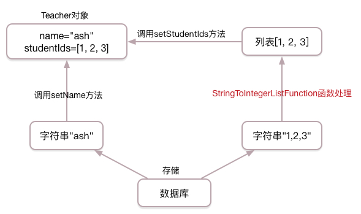
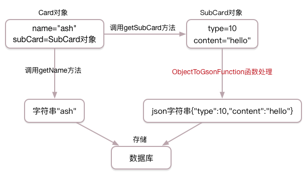
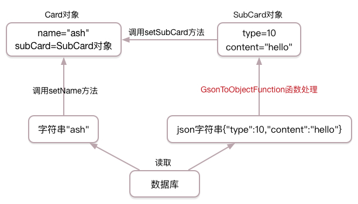

属性转换
========

很多时候我们需要将java中的列表，集合，自定义类映射到关系型数据库的某个字段中，直接插入取出显然是不行的。
mango框架提供了属性转换功能，能轻松实现复杂属性结构到数据库字段的映射。

列表与字符串互转
________________

数据库中的teacher表如下(这里选择的是MySQL数据库):

.. code-block:: sql

    DROP TABLE IF EXISTS `teacher`;
    CREATE TABLE `teacher` (
      `id` int(11) NOT NULL AUTO_INCREMENT,
      `name` varchar(200) NOT NULL,
      `student_ids` varchar(1000) NOT NULL,
      PRIMARY KEY (`id`)
    ) ENGINE=InnoDB DEFAULT CHARSET=utf8;

与teacher表对应的java类:

.. code-block:: java

	public class Teacher {

	  private int id;

	  private String name;

	  @Transfer(IntegerListToStringTransfer.class)
	  private List<Integer> studentIds;

	  // 省略get与set方法

	}

studentIds属性上使用 `@Transfer <https://github.com/jfaster/mango/blob/master/src/main/java/org/jfaster/mango/annotation/Transfer.java>`_ 注解，表明studentIds属性将使用属性转换。

`IntegerListToStringTransfer.class <https://github.com/jfaster/mango/blob/master/src/main/java/org/jfaster/mango/invoker/transfer/IntegerListToStringTransfer.java>`_ 则表明将List<Integer>转换为String存储，同时读取数据时再将String转换为List<Integer>。

TeacherDao类:

.. code-block:: java

	@DB
	public interface TeacherDao {

	    @ReturnGeneratedId
	    @SQL("insert into teacher(name, student_ids) values(:name, :studentIds)")
	    public int addTeacher(Teacher t);

	    @SQL("select id, name, student_ids from teacher where id = :1")
	    public Teacher getTeacherById(int id);

	}

执行 **addTeacher** 方法的流程图如下图所示：

.. image:: _static/functional-list2string.jpg

执行 **getTeacherById** 方法的流程图如下图所示：

枚举与数字互转
________________

数据库中的person表如下(这里选择的是MySQL数据库):

.. code-block:: sql

    DROP TABLE IF EXISTS `person`;
    CREATE TABLE `person` (
      `id` int(11) NOT NULL AUTO_INCREMENT,
      `name` varchar(200) NOT NULL,
      `gender` int(11) NOT NULL,
      PRIMARY KEY (`id`)
    ) ENGINE=InnoDB DEFAULT CHARSET=utf8;

与person表对应的java类:

.. code-block:: java

	public enum Gender {

	  MALE, FEMALE

	}

	public class Person {

	  private int id;

	  private String name;

	  @Transfer(EnumToIntegerTransfer.class)
	  private Gender gender;

	  // 省略get与set方法

	}

gender属性上使用 `@Transfer <https://github.com/jfaster/mango/blob/master/src/main/java/org/jfaster/mango/annotation/Transfer.java>`_ 注解，表明gender属性将使用属性转换。

`EnumToIntegerTransfer.class <https://github.com/jfaster/mango/blob/master/src/main/java/org/jfaster/mango/invoker/transfer/enums/EnumToIntegerTransfer.java>`_ 则表明将Enum转换为Integer存储，同时读取数据时再将Integer转换为Enum。
   
PersonDao类:

.. code-block:: java

	@DB
	public interface PersonDao {

	    @ReturnGeneratedId
	    @SQL("insert into person(name, gender) values(:name, :gender)")
	    public int addPerson(Person p);

	    @SQL("select name, gender from person where id = :1")
	    public Person getPersonById(int id);

	}

执行 **addPerson** 方法的流程图如下图所示：

.. image:: _static/functional-enum2int.jpg

执行 **getPersonById** 方法的流程图如下图所示：

.. image:: _static/functional-int2enum.jpg

复杂类与字符串互转
__________________

数据库中的card表如下(这里选择的是MySQL数据库):

.. code-block:: sql

    DROP TABLE IF EXISTS `card`;
    CREATE TABLE `card` (
      `id` int(11) NOT NULL AUTO_INCREMENT,
      `name` varchar(200) NOT NULL,
      `sub_card` varchar(1000) NOT NULL,
      PRIMARY KEY (`id`)
    ) ENGINE=InnoDB DEFAULT CHARSET=utf8;

与card表对应的java类:

.. code-block:: java

	public class SubCard {

	  private int type;

	  private String content;

	  // 省略get与set方法
	    
	}

	public class Card {

	  private int id;

	  private String name;

	  @Transfer(ObjectToGsonTransfer.class)
	  private SubCard subCard;

	  // 省略get与set方法

	}

subCard属性上使用 `@Transfer <https://github.com/jfaster/mango/blob/master/src/main/java/org/jfaster/mango/annotation/Transfer.java>`_ 注解，表明subCard属性将使用属性转换。

`ObjectToGsonTransfer.class <https://github.com/jfaster/mango/blob/master/src/main/java/org/jfaster/mango/invoker/transfer/json/ObjectToGsonTransfer.java>`_ 则表明将SubCard转换为json存储，同时读取数据时再将json转换为SubCard。
   
CardDao类:

.. code-block:: java

	@DB
	public interface CardDao {

	    @ReturnGeneratedId
	    @SQL("insert into card(name, sub_card) values(:name, :subCard)")
	    public int addCard(Card c);

	    @SQL("select name, sub_card from card where id = :1")
	    public Card getCardById(int id);

	}

执行 **addCard** 方法的流程图如下图所示：

执行 **getCardById** 方法的流程图如下图所示：

查看完整示例代码和表结构
________________________

**属性转换** 的所有代码和表结构均可以在 `mango-example <https://github.com/jfaster/mango-example/tree/master/src/main/java/org/jfaster/mango/example/transfer>`_ 中找到。
